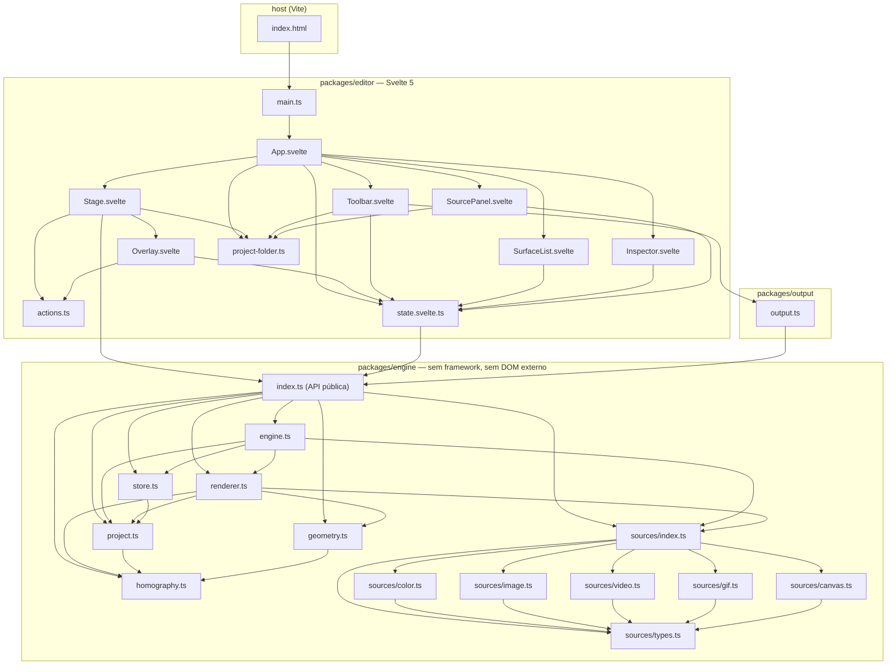

# Arquitetura

Ferramenta de *projection mapping* que roda no navegador: o usuário aponta um projetor
para um objeto físico, desenha superfícies por cima da projeção e joga conteúdo
(imagem, vídeo, GIF, cor, captura de tela, câmera, canvas generativo) dentro de cada uma.

O brief original que originou o código está em [`prompt-mapping-engine.md`](../prompt-mapping-engine.md).

---

## 1. As duas metades e a regra que as separa

**`packages/engine`** é o motor. Zero dependências, zero framework, zero DOM fora do
próprio canvas. Recebe um `Project` (objeto serializável) e devolve frames em um
`WebGL2RenderingContext`. Não sabe que Svelte existe, não lê nada global, não abre
janela, não toca em disco. Tudo o que precisa do mundo externo entra por injeção:
`resolveUrl(path)` e `loadModule(moduleId)` em `EngineOptions`.

**`packages/editor`** é uma das formas possíveis de produzir aquele estado. É Svelte 5
com runes, e **só produz mutações no store** — nunca desenha na tela de saída, nunca fala
com WebGL diretamente. Toda a UI vive em SVG e HTML *por cima* do canvas da engine.

**`packages/output`** é a cola entre os dois para a segunda tela: abre uma janela limpa,
cria um canvas e instancia uma segunda `Engine` compartilhando o mesmo `Store`.

A costura entre as metades é uma única assinatura:

```ts
store.subscribe(fn) // chama fn imediatamente, devolve a função de cancelamento
```

Isso **é** o contrato de store do Svelte. O editor escreve `$store` sem uma linha de
adaptador, e [`store.ts`](../packages/engine/store.ts) segue sem importar framework nenhum.

### Grafo de módulos



Nenhuma seta sai da caixa `engine` em direção a `editor` ou `output`. Essa é a fronteira.

---

## 2. Mapa de arquivos

### Engine

#### [`packages/engine/project.ts`](../packages/engine/project.ts)

O contrato de dados. Define os tipos `Vec2`, `Source` (união discriminada com os sete
kinds: `image`, `video`, `gif`, `color`, `capture`, `camera`, `canvas`), `Shape`
(`quad` | `ellipse` | `polygon`), `Surface`, `Project`, além de `ViewState` e
`TestPattern`. Exporta `newId(prefix)`, `emptyProject(width, height)`,
`newSurface(project, name?)` (superfície centrada com um quarto do tamanho da saída),
`parseProject(raw)` e `clamp(v, lo, hi)`. `parseProject` é a fronteira de confiança:
recebe JSON não confiável de disco, preenche defaults, valida enums via helpers privados
(`num`, `str`, `bool`, `oneOf`, `parseFrame`, `parseShape`, `parseCrop`) e **descarta** o
que não reconhece, inclusive referências de `sourceId` penduradas — um canto `NaN` chegando
ao renderer apagaria o projetor no meio do show. `ViewState` (solo, seleção, padrão de
teste, `uiHidden`) mora fora de `Project` de propósito: é auxílio de ensaio, não parte do
espetáculo, e não deve voltar ao reabrir a pasta.

#### [`packages/engine/homography.ts`](../packages/engine/homography.ts)

A matemática projetiva, sem nada mais. Define `Mat3` (row-major, 9 números), `Vec2` e
`Quad` (TL, TR, BR, BL — a mesma ordem de `Surface.frame`). Exporta
`solveUnitToQuad(quad)`, que monta o sistema linear 8x8 clássico (h33 fixo em 1) e o
resolve por eliminação gaussiana com pivotamento parcial na função privada `solveLinear` —
quadriláteros degenerados devolvem `null` em vez de envenenar o loop de render com NaN.
Exporta ainda `invert(h)` (inversa por adjunta), `apply(h, p)` (aplica e divide por w),
`applyH(h, p)` (aplica **preservando** o w homogêneo, que é o que o renderer precisa por
vértice) e `quadToUnit(quad)` (pixels da saída → espaço do frame, usado em hit-test e no
polígono livre). O `W` não é ruído a ser dividido e esquecido: é ele que evita a dobra
diagonal.

#### [`packages/engine/geometry.ts`](../packages/engine/geometry.ts)

Geometria plana pura. Exporta `bounds(points)` (caixa envolvente alinhada aos eixos),
`signedArea(poly)` (área com sinal, usada para descobrir o *winding*),
`pointInPolygon(p, poly)` (ray casting), `triangulate(poly)` (ear clipping O(n²) que
devolve triplas de índices, com um `guard` que aborta em polígono auto-interseccionante em
vez de travar) e a constante `UNIT_QUAD` — o contorno do quadrado unitário no espaço do
frame, usado como geometria de `quad` e `ellipse`. As funções privadas `cross` e
`pointInTriangle` sustentam o teste de orelha.

#### [`packages/engine/renderer.ts`](../packages/engine/renderer.ts)

O coração gráfico: uma classe `Renderer` que desenha um `Project` num canvas WebGL2 e mais
nada. Contém os dois shaders como strings (`VERT` e `FRAG`, GLSL ES 3.00), cria o contexto
com `alpha: false`, `premultipliedAlpha: true`, `antialias: true`,
`preserveDrawingBuffer: false` e `clearColor(0,0,0,1)` — preto absoluto, nunca clareado.
`render(project, surfaces, pool, view, pattern)` limpa, sobe os uniformes globais
(`uResolution`, `uView`, `uTime`) e chama o privado `#drawSurface` por superfície, já
recebendo a lista ordenada por z. `#drawSurface` resolve a homografia do frame, escolhe o
modo de desenho via `#modeFor` (0 textura, 1 mídia faltando, 2 nada), monta os vértices em
`#geometry` (unit quad para quad/elipse, triangulação própria para polígono), sobe
`uH`/`uUVXform`/`uOpacity`/`uMask`/`uFeather`, aplica `setBlend` e desenha com
`drawElements`. `#numberTexture(n)` rasteriza o número da superfície num canvas 2D e
cacheia a textura, e `surfaceNumber(project, surface)` decide **qual** número é esse:
posição na ordem z decrescente, a mesma da lista do editor, para o número projetado bater
com o item selecionado. Também exporta as funções puras `toColumnMajor(h)`,
`uvTransform(surface, source)` (dobra `crop` e `fit` num par escala/deslocamento),
`uvMatrix(surface, source)` (compõe `crop`, `fit` e **rotação** num `mat3`
column-major — a rotação é aplicada em torno do centro do frame, então o conteúdo
gira no lugar em vez de sair da forma), `isQuarterTurned(rotation)`,
`frameAspectOf(surface)` (aspecto aproximado de um frame em perspectiva: média das arestas
opostas), `frameToPixel(h, u, v)` e as constantes `IDENTITY_VIEW` / o tipo `ViewTransform`.

#### [`packages/engine/warp.ts`](../packages/engine/warp.ts)

A malha livre: a camada entre o frame e o recorte. Exporta `identityWarp`, `isIdentity`,
`evaluateWarp` (a função que define o que a superfície **é** — o render tesselava, a
reamostragem relê e o hit-test inverte), `unwarp`, `tessellate`, `resampleWarp` e
`parseWarp`. Ponto de controle é **posição**, em espaço do frame, e não coordenada de
textura.

Uma armadilha registrada no código: interpolar Catmull-Rom repetindo o ponto de borda faz
a grade identidade deixar de ser identidade — a spline curva. Extrapolar o vizinho
(`2·borda − interno`) mantém pontos igualmente espaçados colineares, e spline por pontos
colineares é a reta. Sem isso, "aplanar" não seria confiável.

#### [`packages/engine/store.ts`](../packages/engine/store.ts)

Fonte única de verdade. A classe `Store` guarda `{ project, view }` em campos privados,
expõe getters `state`/`project`/`view` e `subscribe(fn)` no contrato Svelte. Toda mutação
de projeto passa por `mutate(fn, opts)`, que faz `structuredClone` do projeto, aplica a
mutação, empilha o histórico e notifica — em um lugar só. `MutateOpts.coalesce` agrupa uma
gesta inteira (arrastar um canto dispara dezenas de mutações) numa única entrada de
histórico; `endGesture()` fecha o grupo. Os métodos públicos são a API de controle externo:
`load`, `toJSON`, `setOutputSize`, `undo`/`redo` (com `canUndo`/`canRedo`),
`addSurface`, `removeSurface`, `duplicateSurface`, `patchSurface`, `setCorner`,
`nudgeCorner`, `moveSurface`, `setSurfaceFrame`, `setCrop`, `setPolygonPoint`,
`setSurfaceShape`, `setSurfaceSource`, `toggleLock`, `toggleVisible`, `toggleSolo`,
`setOpacity`, `setRotation`, `reorder`, `enableWarp`, `disableWarp`, `resetWarp`,
`setWarpPoint`, `nudgeWarpPoint`, `setWarpGrid`, `setWarpInterpolation`, `addSource`,
`removeSource`, `patchSource`, `setSourceColor`, `setCameraDevice`, `relinkSource`,
`setView`, `setTestPattern` e `setSurfacePattern`. O guard privado `#editable(id)`
faz o *lock* ser real: `setCorner`, `nudgeCorner`, `moveSurface` e `setSurfaceFrame`
simplesmente não fazem nada numa superfície travada, e `patchSurface` descarta `frame` do
patch pelo mesmo motivo — o adaptador de controle externo chama esses mesmos métodos e não
pode atravessar a trava. Nome, visibilidade e o próprio `locked` continuam passando, senão
uma superfície travada nunca poderia ser destravada. No fim do arquivo, a função livre
`visibleSurfaces(state)` devolve o que o renderer deve desenhar, aplicando solo, `visible` e
ordenação por z, e `patternFor(state, id)` resolve o padrão de teste de cada superfície: o
dela, se tiver, senão o global. `Renderer.render` recebe essa resolução como **função**, e
não como um valor único, para não precisar saber de onde vem a decisão.

#### [`packages/engine/engine.ts`](../packages/engine/engine.ts)

A engine inteira atrás de um objeto. A classe `Engine` possui um `Store`, um `Renderer`, um
`SourcePool`, um canvas e o loop de RAF — e nada além disso. O construtor aceita
`EngineOptions` (`store` para compartilhar entre janelas, `resolveUrl`, `loadModule`,
`devicePixelRatio`), assina o store para marcar `#dirty` a cada mudança e registra um
listener de `pointerdown` no `ownerDocument` do canvas para chamar `pool.unlock()` no
primeiro gesto (autoplay bloqueado). `start()`/`stop()` controlam o loop; `#frame()` roda
`pool.sync` + `pool.update` sempre, mas **só redesenha** se `#dirty` ou se
`pool.hasAnimated` — instalação parada não segura a GPU a 60fps à toa. `renderFrame(state)`
dobra o `devicePixelRatio` no `ViewTransform` e chama `renderer.render`. Os métodos
`load`, `setSurfaceFrame`, `setSurfaceSource`, `setTestPattern`, `setView`, `resize`,
`invalidate`, `on('change', cb)` e `dispose()` são a API pública pedida no brief; a função
`createEngine(canvas, project, opts)` é o atalho de fábrica.

#### [`packages/engine/index.ts`](../packages/engine/index.ts)

A API pública, e só isso: reexporta `createEngine`/`Engine`, `Store`/`visibleSurfaces`,
os helpers e tipos de `project.ts`, as funções de `homography.ts` e `geometry.ts`,
`Renderer` com `IDENTITY_VIEW`/`frameToPixel`/`uvTransform`/`frameAspectOf`,
`SourcePool`/`createSource` e os tipos `TextureSource`/`SourceContext`/`CanvasModule`.
Qualquer coisa não listada aqui é detalhe de implementação. O editor importa
`../engine/index.ts` — nunca arquivos internos, com a única exceção do tipo `Engine` em
[`state.svelte.ts`](../packages/editor/state.svelte.ts).

#### [`packages/engine/sources/types.ts`](../packages/engine/sources/types.ts)

A única interface que o renderer conhece: `TextureSource`, com `size`, `isDirty`,
`status` (`loading` | `ready` | `error`), `error?`, `animated`, `getTexture(gl)`,
`update(gl)` e `dispose(gl)`. Toda espécie de conteúdo — uma cor, um vídeo, a janela de
outro programa — se reduz a "aqui está uma textura e o tamanho dela". Define também
`SourceContext` (`resolveUrl`, `loadModule?`), que é como o host injeta acesso a arquivos
sem a engine tocar na File System Access API, e `CanvasModule` (`draw(ctx, t)`, `size?`).
Exporta `createTexture(gl)` (clamp + linear, sem mipmap) e `uploadTexture(gl, tex, src)` —
a **única** função de upload do projeto, com `UNPACK_FLIP_Y_WEBGL` e
`UNPACK_PREMULTIPLY_ALPHA_WEBGL` sempre ligados.

#### [`packages/engine/sources/index.ts`](../packages/engine/sources/index.ts)

Fábrica e cache. `createSource(desc, ctx)` faz o switch sobre `Source['kind']` e devolve a
implementação certa. A classe `SourcePool` mantém um `Map` **por id de fonte, nunca por
superfície** — um clipe alimentando dez superfícies decodifica uma vez e sobe uma vez por
frame. `sync(gl, descs)` reconcilia o cache contra a lista do projeto: reconstrói o que
mudou de forma irrecuperável (caminho de arquivo novo) e apenas remenda o que dá
(`#patch` trata cor e parâmetros de playback de vídeo), descartando o que sumiu do projeto.
`get(id)` devolve a fonte, `hasAnimated` diz ao loop se pode dormir, `update(gl)` chama
`update` em todas, `unlock()` destrava a reprodução após o primeiro gesto e
`disposeAll(gl)` limpa tudo.

#### [`packages/engine/sources/color.ts`](../packages/engine/sources/color.ts)

`ColorSource` — uma textura 1x1. É a fonte mais barata para acender uma forma e a primeira
que se usa ao alinhar contra uma aresta física. Expõe `setColor(rgb)` (marca `isDirty`) e
sobe o pixel com `texImage2D` direto de um `Uint8Array`, com flip e premultiply desligados
porque os dados já estão na ordem certa e são opacos. `animated` é `false` e `status` é
sempre `'ready'`.

#### [`packages/engine/sources/image.ts`](../packages/engine/sources/image.ts)

`ImageSource` — imagem estática. O construtor dispara `#load(path, ctx)`, que resolve o
caminho por `ctx.resolveUrl`, faz `fetch` e cria um `ImageBitmap` já com
`premultiplyAlpha: 'premultiply'` (cinto e suspensório: premultiplica aqui *e* no upload,
para o caso de um navegador ignorar a flag de unpack). Decodifica uma vez, sobe uma vez, e
depois nunca mais toca na GPU (`animated = false`, `isDirty` volta a `false` no primeiro
`update`). Falha vira `status = 'error'` com mensagem em português.

#### [`packages/engine/sources/video.ts`](../packages/engine/sources/video.ts)

Três classes sobre uma base. `VideoTextureSource` é qualquer coisa que pinta num
`<video>`: cria o elemento com `muted`/`playsInline`/`loop`, ouve `loadedmetadata` e
`error`, e agenda o upload por `requestVideoFrameCallback` no privado `#scheduleFrame` —
com fallback de marcar sujo todo frame quando a API falta. Expõe `unlock()`,
`setPlayback({loop, muted, rate})` e os `protected setSrcObject`/`setSrcUrl`.
`FileVideoSource` resolve um caminho do projeto (WebM com alfa funciona e é como se produz
conteúdo recortado para projeção). `CaptureSource` usa `getDisplayMedia()` — é o
Spout/Syphon do navegador: qualquer aplicativo da máquina vira textura mapeável.
`CameraSource` usa `getUserMedia()` com `deviceId` opcional. As três degradam para
`status: 'error'` com aviso claro quando a API não existe ou é recusada.

#### [`packages/engine/sources/gif.ts`](../packages/engine/sources/gif.ts)

`GifSource` — GIF animado (e APNG/WebP/AVIF animados de brinde). Um `` com GIF não dá
acesso aos quadros, então `#load` usa o `ImageDecoder` do WebCodecs (tipado localmente como
`ImageDecoderLike`/`VideoFrameLike` porque falta em alguns `lib.dom`), lê `frameCount` do
track selecionado e avança com relógio próprio: `#decodeFrame(i)` guarda o `VideoFrame`
pendente e calcula `#nextAt` a partir da duração declarada do quadro (microssegundos;
100ms quando não há). `update` compara `performance.now()` com `#nextAt` para trocar de
quadro. Se `ImageDecoder` faltar, `#loadFallback` desenha o `` num canvas 2D a cada
frame — anima, mas o navegador é quem controla o tempo.

#### [`packages/engine/sources/canvas.ts`](../packages/engine/sources/canvas.ts)

`CanvasSource` — conteúdo generativo. Recebe um `moduleId`, pede o módulo ao
`ctx.loadModule` e, a cada `update`, limpa um canvas 2D interno, chama
`module.draw(ctx2d, tSegundos)` e sobe o resultado por `uploadTexture`. É o ponto de
extensão que impede a engine de precisar saber o que é "conteúdo". Um módulo que lança
exceção vira `status = 'error'` dentro de um `try/catch` — um módulo do usuário não derruba
o show. Sem `loadModule` configurado, a fonte já nasce em erro com mensagem explícita.

#### [`packages/engine/math.test.ts`](../packages/engine/math.test.ts)

Testes de `node:test` sobre a matemática, escritos antes de qualquer render conforme o
brief. Verificam que os cantos do quadrado unitário caem exatamente nos cantos do quad, que
a ida e volta por `H` e `invert(H)` volta ao ponto de origem com erro abaixo de `1e-9` numa
grade 9x9, que `quadToUnit` é mesmo a inversa, que um quad degenerado devolve `null`, e
cobrem `triangulate` (convexo e côncavo), `pointInPolygon`, `signedArea` e `bounds`.

#### [`packages/engine/store.test.ts`](../packages/engine/store.test.ts)

Testes do store: undo/redo restaura e refaz, uma gesta de 20 `setCorner` colapsa em **uma**
entrada de histórico, superfície travada rejeita `setCorner`/`moveSurface`/`nudgeCorner`,
`subscribe` dispara imediatamente e para de disparar após o unsubscribe, `visibleSurfaces`
respeita solo/visible/ordem z, remover uma fonte limpa os `sourceId` que apontavam para ela,
e o round-trip por JSON derruba referência pendurada.

#### [`packages/engine/renderer.test.ts`](../packages/engine/renderer.test.ts)

Testes das funções puras do renderer, sem GPU: `frameAspectOf` num retângulo,
`uvTransform` em `stretch`/`cover`/`contain` (incluindo a troca de eixo quando a fonte é
alta e a interação com `crop`), e `toColumnMajor` transpondo. Usa um `fakeSource` que
implementa `TextureSource` com stubs.

### Editor

#### [`packages/editor/main.ts`](../packages/editor/main.ts)

Ponto de entrada. Importa `app.css`, procura `#app` no documento (lança se não achar) e
monta `App` com a API `mount()` do Svelte 5. Sete linhas, nada mais.

#### [`packages/editor/state.svelte.ts`](../packages/editor/state.svelte.ts)

O estado do editor e os helpers de coordenada. Cria e exporta a instância única `store`
(um `Store` da engine com `emptyProject(1920, 1080)`), que é a mesma referência passada à
janela de saída. Exporta o rune `ui = $state({...})` com o que nunca é salvo:
`scale`/`tx`/`ty` do pan-zoom, `tool` (`select` | `polygon`), `snap`/`snapOff`,
`pendingPolygon`, `status` e `folderName`. Exporta `setEngine`/`getEngine` (referência
imperativa à `Engine` montada), `toOutput(p)`/`toScreen(p)` (pixels da tela ↔ pixels da
saída), `fitView(w, h)`, `snapPoint(p, exceptId)` (raio fixo de 8px de tela, portanto mais
fino ao dar zoom; só canto contra canto, por decisão documentada no arquivo),
`surfaceAt(p)` (topmost por z, testando `0..1` no espaço do frame via `quadToUnit` +
`apply`), `selected()` e `flash(message)` (aviso temporário de 4s).

#### [`packages/editor/actions.ts`](../packages/editor/actions.ts)

Todo o comportamento imperativo de ponteiro, isolado em duas *actions* (`use:`), fora do
ciclo de render da UI. `drag(node, params)` implementa a gesta completa — pointer capture,
ponto local relativo ao `[data-stage]`, deltas, limpeza — e chama `onStart`/`onMove`/`onEnd`
do chamador; `params.disabled` cancela a gesta inteira, que é como as superfícies travadas
se recusam a mover. `panZoom(node, params)` faz zoom por roda (`Math.exp(-deltaY * 0.0015)`,
~10% por entalhe) e pan por botão do meio ou Alt+arrastar. Ambas devolvem o par
`{ update, destroy }` que o Svelte espera.

#### [`packages/editor/App.svelte`](../packages/editor/App.svelte)

A casca. Compõe `Toolbar`, `Stage` e a barra lateral (`SurfaceList`, `Inspector`,
`SourcePanel`), escondendo tudo quando `$store.view.uiHidden` está ligado — no modo de
saída limpa não existe pixel de UI. Um `$effect` observa `$store.project` e chama
`scheduleSave` a cada mudança (pulando a primeira execução), outro avisa e recarrega do
`localStorage` quando não há File System Access. `onKeyDown` concentra os atalhos: Ctrl+Z /
Ctrl+Shift+Z / Ctrl+Y para histórico, Ctrl+D duplica, `Escape` cancela o polígono, `H`
esconde a UI, `Delete`/`Backspace` apaga, e as **setas movem 1px (10px com Shift)** — o
canto selecionado se houver um, senão a superfície inteira. `onKeyUp` chama
`store.endGesture()` ao soltar a seta, fechando a entrada de histórico.

#### [`packages/editor/Stage.svelte`](../packages/editor/Stage.svelte)

A área de trabalho: um `<div data-stage>` com o `<canvas>` da engine embaixo e o `Overlay`
por cima. No `onMount` cria a engine com `createEngine(canvas, store.project, { store,
resolveUrl, loadModule, devicePixelRatio })`, chama `start()`, observa o redimensionamento
com `ResizeObserver` e enquadra a saída; no teardown faz `dispose()`. Um `$effect` espelha
`ui.scale/tx/ty` em `engine.setView` — pan e zoom são transformação de visualização a
caminho do clip space, nunca mudança nas coordenadas do projeto. `onPointerDown` seleciona
a superfície sob o cursor (ou acumula pontos no modo polígono) e `finishPolygon()` converte
o traçado livre em superfície normal: a caixa envolvente vira o `frame` e os pontos entram
em espaço de frame pela homografia inversa. `onDrop` implementa o quarto passo do fluxo de
60 segundos — arrastar um arquivo em cima de uma superfície importa a mídia, cria a `Source`
(`kindOf`/`describe`) e a atribui.

#### [`packages/editor/Overlay.svelte`](../packages/editor/Overlay.svelte)

A camada de manipulação, um `<svg>` transparente com `pointer-events: none` no container —
só as alças e o interior dos frames recebem clique, o resto atravessa até a `Stage`. Desenha
o retângulo da saída, o contorno e o nome de cada superfície, e as quatro alças circulares
quando ela está selecionada e destravada. O `path` do frame usa `use:drag` com
`disabled: surface.locked` para mover a superfície inteira via `store.moveSurface`; cada
alça usa `use:drag` chamando `store.setCorner(id, i, snapPoint(toOutput(p), id))`, com
`onEnd: () => store.endGesture()`. Também renderiza o polígono em traçado
(`ui.pendingPolygon`). Nenhum estado local: tudo lido de `$store` e `ui`.

#### [`packages/editor/Toolbar.svelte`](../packages/editor/Toolbar.svelte)

Só o que se toca **enquanto alinha**: nova superfície, ferramenta polígono,
desfazer/refazer (ligados a `store.canUndo`/`canRedo`), ímã (snap), o seletor dos oito
padrões de teste, enquadrar e esconder UI. Tudo o que é de começo e de fim de montagem
mudou-se para [`ProjectPanel.svelte`](../packages/editor/ProjectPanel.svelte), que é o
que torna esta barra legível.

#### [`packages/editor/TopBar.svelte`](../packages/editor/TopBar.svelte)

Marca à esquerda, **informação de contexto no centro**, ações discretas à direita. O
centro responde, sem ninguém perguntar, o que se quer saber de relance no meio de uma
montagem: onde o projeto está sendo salvo (com um ponto que fica verde por dois segundos
a cada autosave), a resolução da saída, quantas superfícies existem e se a projeção está
no ar. É informação, não mais botões — a barra de trabalho já tem os botões. O seletor de
tema é **um** ícone com menu suspenso, e não três botões: o controle não pode competir em
peso visual com o que a pessoa veio fazer.

#### [`packages/editor/theme.svelte.ts`](../packages/editor/theme.svelte.ts)

`applyTheme(next)` grava `data-theme` no elemento raiz e persiste em `localStorage`;
`'system'` **remove** o atributo, deixando o `--prefersdark` do daisyUI resolver pela
preferência do sistema — seguir o sistema sem uma linha de JS de cálculo.

#### [`packages/editor/ProjectPanel.svelte`](../packages/editor/ProjectPanel.svelte)

Pasta do projeto, salvar, resolução de saída, escolha de tela e o botão que abre a janela
de saída (passando o `SourcePool` do editor). Vive num `<details>` recolhível que começa
aberto e se fecha quando existe pasta: é trabalho de começo e de fim de montagem, e não
pode empurrar as superfícies para fora da tela durante o alinhamento. Enumera as telas na
montagem, nunca no clique, pelo motivo descrito em `output.ts`.

#### [`packages/editor/AboutPage.svelte`](../packages/editor/AboutPage.svelte)

O "sobre", como página inteira ao lado do guia — foi um `<dialog>` até virar longo demais
para um modal. Tipografia de jornal: coluna estreita, serifa, fios finos, capitular,
citação com fio à esquerda, e só fontes do sistema, porque carregar fonte externa
quebraria o uso offline. O texto conta por que a ferramenta existe e o que a licença
garante; como usar é assunto do guia.

#### [`packages/editor/i18n/`](../packages/editor/i18n)

`en.ts` é a fonte da verdade e de onde saem os tipos (`MessageKey = keyof typeof en`);
`pt.ts` e `es.ts` são `Record<MessageKey, string>`, então uma chave que falta é erro de
compilação. `index.svelte.ts` traz `t(key, params)` — interpolação `{nome}` e plural por
`Intl.PluralRules`, com a chave base servindo de forma geral e o sufixo `_one` de
singular —, a detecção por `navigator.languages`, a persistência da escolha e o
`document.documentElement.lang`. `t` lê `i18n.locale` dentro de um rune, e é isso que faz
a interface inteira trocar de idioma sem store, sem adaptador e sem recarregar a página.

#### [`packages/editor/DocsPage.svelte`](../packages/editor/DocsPage.svelte) e [`i18n/docs/`](../packages/editor/i18n/docs)

O guia de uso, no padrão de documentação técnica: índice fixo à esquerda que acompanha
a leitura e uma coluna de no máximo 72 caracteres. O conteúdo não são chaves soltas de
catálogo, e sim uma estrutura tipada (`Section` com blocos `p`, `steps`, `list`, `keys`,
`note`, `code`) — texto longo pede estrutura, não cem chaves planas. Um teste compara as
três línguas seção a seção. A página **cobre** o editor em vez de substituí-lo:
desmontar a `Stage` destruiria o contexto WebGL e faria a captura de tela pedir
permissão de novo na volta; enquanto uma página de texto está aberta — guia ou sobre —
o loop de render é pausado, e `Esc` volta para o editor.

A seção ativa do índice vem da geometria, não da primeira interseção do
`IntersectionObserver` — escolher pela primeira marca a seção anterior, justamente
quando se está começando a ler a nova.

#### [`packages/editor/Icon.svelte`](../packages/editor/Icon.svelte) e [`links.ts`](../packages/editor/links.ts)

Ícones em SVG inline (sem fonte de ícone, sem CDN: um ícone que não carrega vira botão
sem rótulo) e o endereço do repositório em um lugar só. Só entram ícones que valem mais
que uma palavra — botão de ação continua com texto, que é mais explicativo.

#### [`packages/editor/SurfaceList.svelte`](../packages/editor/SurfaceList.svelte)

A lista de superfícies em ordem z decrescente (`$derived`). Cada linha seleciona ao clicar,
renomeia ao duplo clique (`commitRename` → `store.patchSurface(id, { name })` — uma lista de
"Superfície 7" é inútil, "quadro da esquerda" não é) e traz os três toggles de afordância:
**S** solo (`toggleSolo`), **M** mudo (`toggleVisible`) e o cadeado (`toggleLock`). No pé,
os botões nova / duplicar / apagar. Estado vazio com a instrução do primeiro passo.

#### [`packages/editor/Inspector.svelte`](../packages/editor/Inspector.svelte)

O painel da superfície selecionada (`$derived` sobre `$store`). Troca a forma entre `quad` e
`ellipse` via `store.setSurfaceShape` (o botão `polígono` fica desabilitado — polígono só
nasce da ferramenta de traçado), mostra o slider de `feather` quando a forma é elipse, e os
selects de `fit` (esticar/caber/preencher) e `blend` (normal/soma/screen/multiply). O texto
de ajuda no rodapé documenta o ajuste fino por setas.

Três seções ficam **recolhidas**, num `<details>` cada: *aparência e ordem* (opacidade e z),
*recorte dentro da fonte* e *malha livre*. A regra é a mesma nas três — controle que se
ajusta uma vez e não se toca mais não merece espaço permanente, e abertas empurravam
encaixe, mistura e padrão para fora da tela. Cada uma carrega um distintivo no cabeçalho
quando está fazendo alguma coisa (a porcentagem, `recorte ativo`, `malha ativa`), porque
uma superfície apagada por uma opacidade que não se vê é um mistério caro no meio de um
show. O cabeçalho vem do snippet `fold(label, badge)`, um só para as três.

#### [`packages/editor/SourcePanel.svelte`](../packages/editor/SourcePanel.svelte)

O painel de fontes. Botões criam cor, captura de tela e câmera (`addColor`, `addCapture`,
`addCamera`, todos via o helper `add` que já atribui à superfície selecionada) e um
`<input type="file">` múltiplo importa arquivos por `addFiles`, classificando GIF/vídeo/
imagem pelo MIME. A lista mostra cada fonte com amostra de cor, kind e nome; clicar atribui,
`×` remove (`store.removeSource`, que limpa os `sourceId` órfãos). `statusOf(id)` lê o
estado ao vivo direto do `SourcePool` via `getEngine()`, para que um arquivo faltando
apareça aqui e não só como retângulo magenta na parede. Fontes de cor ganham um
`<input type="color">` que chama `store.patchSource`.

#### [`packages/editor/project-folder.ts`](../packages/editor/project-folder.ts)

A persistência: um projeto é uma **pasta**, não um arquivo. `openFolder()` usa
`showDirectoryPicker({ mode: 'readwrite' })`, guarda o handle em módulo e devolve o texto de
`project.json` (ou `null` — pasta vazia é projeto novo, não erro). `resolveUrl(path)` anda
pelos segmentos do caminho relativo, abre o arquivo e devolve um object URL cacheado; é
exatamente essa função que é injetada na engine, e é o `throw` dela que faz a superfície
mostrar o padrão de mídia faltando. `importFile(file)` copia o arquivo solto para dentro da
pasta e devolve o caminho relativo; `loadModule(moduleId)` faz `import()` dinâmico de um
módulo de canvas e valida que ele exporta `draw`. `scheduleSave`/`save` fazem autosave com
debounce de 400ms — perder meia hora de alinhamento por um crash é inaceitável.
Sem File System Access, degrada em voz alta: mídia em memória (`memoryFiles`), JSON em
`localStorage` (`localProject`), e `downloadProject` para exportar à mão.
`hasFileSystemAccess`, `folderName()` e `invalidateUrls()` completam a superfície pública.

#### [`packages/editor/app.css`](../packages/editor/app.css)

As variáveis de tema (dark-only por decisão: tema claro numa sala escura é risco, não
recurso) e o reset mínimo dos controles. `--accent`, `--danger`, `--panel`, `--line` etc.
são as únicas cores usadas pelos componentes.

### Saída

#### [`packages/engine/sources/types.ts`](../packages/engine/sources/types.ts) — nota sobre `ContextTextures`

Além da interface `TextureSource` e de `uploadTexture`, este arquivo define
`ContextTextures`: um `WebGLTexture` por contexto GL, mais a versão de conteúdo que cada
contexto subiu por último. Existe porque textura não atravessa janela, mas o `<video>` e
o `ImageDecoder` atravessam — então o editor e a saída compartilham **a fonte** e têm
cada um **a sua textura**. `invalidate()` marca conteúdo novo, `isStale(gl)` diz quem
está atrasado, `release(gl)` derruba só as texturas de uma janela e `disposeAll()` mata
tudo. O `isDirty` da interface virou um getter derivado disso: um booleano único não
sobrevive a dois consumidores, porque quem subisse primeiro apagaria o aviso do outro.
`TextureSource` ganhou `release(gl)` ao lado de `dispose(gl)` pela mesma razão.

#### [`packages/output/output.ts`](../packages/output/output.ts)

A janela de saída limpa. Declara localmente as interfaces `ScreenDetailed`/`ScreenDetails`
da Window Management API (Chromium-only, ausente de alguns `lib.dom`) e exporta
`hasWindowManagement()` (exige `getScreenDetails` **e** `screen.isExtended`), `listScreens()`
(devolve `[]` em vez de lançar quando a permissão é negada) e `openOutput(store, opts)` —
esta última **síncrona de propósito**, recebendo a tela já enumerada, para não gastar a
ativação de usuário. `openOutput` abre um popup posicionado sobre a tela
escolhida, monta um `document` sem margem, com `background:#000` e `cursor:none`, cria um
`<canvas>` e instancia uma **segunda** `Engine` com o mesmo `Store` e o `devicePixelRatio`
nativo da tela. `applySize` redimensiona e faz letterbox se a janela não bater com a
resolução do projeto — saída esticada é saída desalinhada. O `requestFullscreen({ screen })`
é chamado antes de qualquer `await`, ainda dentro do gesto do usuário (Fullscreen Companion
Window), e cai para um aviso quando falha. A decisão documentada no arquivo: as duas janelas compartilham
o objeto `Store` **por referência**, não por `BroadcastChannel`, porque em `file://` cada
documento tem origem opaca e o canal não conecta — mas uma janela aberta com
`window.open('')` herda o realm do opener. Cada janela mantém contexto GL próprio, porque
contexto GL não atravessa janela — mas **compartilha o `SourcePool`** por `OutputOptions.pool`,
para não decodificar cada vídeo duas vezes nem pedir permissão de captura de novo. O ciclo
de vida converge num `teardown` único, alcançado por `pagehide` e `beforeunload` da janela
filha, por `pagehide` do editor (reload não deixa janela zumbi no projetor) e pelo `close()`
do chamador; `onClose` avisa a toolbar para o botão voltar a dizer "saída". A janela também
escuta `Escape` — é o único controle que ela tem, já que não há UI, cursor nem barra de
título. Um `subscribe` no store re-aplica o letterbox quando a resolução do projeto muda.

#### [`scripts/smoke.mjs`](../scripts/smoke.mjs)

O teste de integração, fora de `packages/` porque não é código de produto. Sobe chromium
headless pelo Playwright com SwiftShader (`--use-angle=swiftshader`), abre o
`dist/index.html` por `file://`, opera a UI real (`+ superfície`, `cor`, seletor de padrão)
e lê pixels com `gl.readPixels` depois de forçar um frame por `engine.renderFrame()`. É o
que prova AC-14 a AC-20 de [`SPEC.md`](SPEC.md), incluindo a medição objetiva da armadilha
nº 1: ajusta uma reta por mínimos quadrados à borda entre duas barras de cor num
quadrilátero fortemente deformado e falha se o desvio máximo passar de 1,5 px. O handle
global `window.engine` que ele usa é criado em `Stage.svelte`.

#### [`public/`](../public) e o service worker gerado

`public/` guarda o que **não** pode ser embutido no HTML: `manifest.webmanifest` e os
três ícones (gerados por [`scripts/make-icons.mjs`](../scripts/make-icons.mjs), que
desenha um quad em perspectiva com as quatro alças e tira um screenshot com o
Playwright já instalado). O `sw.js` não fica aqui: é escrito no `closeBundle` por um
plugin em [`vite.config.ts`](../vite.config.ts), com o nome do cache derivado do hash
do `index.html` construído — um service worker com versão constante nunca atualiza e
serve o app antigo para sempre. O registro em `main.ts` é guardado por
`location.protocol`, porque registrar service worker a partir de `file://` lança, e é
justamente por `file://` que o arquivo avulso roda.

#### [`vite.lib.config.ts`](../vite.lib.config.ts) e [`examples/embed/`](../examples/embed)

A engine construída como biblioteca (`npm run build:lib`): ESM sem minificação, sem
`publicDir`, mais declarações de tipo por um `tsconfig.lib.json` que usa
`rewriteRelativeImportExtensions` para emitir `.d.ts` a partir de imports `.ts`. É o que
transforma "a engine roda sem o editor" de frase em artefato. `examples/embed/` importa
**o arquivo construído**, não o código-fonte, que é o que um terceiro faria.

### Configuração

#### [`vite.config.ts`](../vite.config.ts)

`base: './'` mais os plugins `svelte()` e `viteSingleFile()`, com `assetsInlineLimit`
gigantesco e `cssCodeSplit: false`: o build sai como um único `.html` que abre de um pendrive
por `file://`, sem servidor e sem rede. Em local de montagem não existe wi-fi confiável.

#### [`tsconfig.json`](../tsconfig.json)

TypeScript estrito de verdade: `strict`, `noUncheckedIndexedAccess`, `noImplicitOverride`,
`noUnusedLocals`, `noUnusedParameters`, `verbatimModuleSyntax`, `isolatedModules`,
`moduleResolution: "bundler"` com `allowImportingTsExtensions` (daí os imports terminarem em
`.ts`). `noEmit` — quem compila é o Vite.

#### [`index.html`](../index.html)

Doze linhas: `lang="pt-BR"`, um `<div id="app">` e o módulo
`/packages/editor/main.ts`. Nada de CDN, nada de fonte remota.

#### [`package.json`](../package.json)

Scripts `dev`/`build`/`preview` (Vite), `test` (`node --test 'packages/engine/*.test.ts'` —
os testes rodam direto no Node, sem runner) e `check` (`tsc --noEmit && svelte-check`).
Todas as dependências são de desenvolvimento: o bundle final não carrega biblioteca alguma
de runtime além do próprio Svelte compilado.

---

## 3. Fluxo de dados

### Trace A — um frame completo

1. **Loop.** `Engine.start()` agendou `#frame()` no `requestAnimationFrame` da janela
   *dona do canvas* (`canvas.ownerDocument.defaultView`), então a janela de saída roda no
   relógio dela. Ver [`engine.ts`](../packages/engine/engine.ts).
2. **Fontes.** `#frame()` chama `pool.sync(gl, state.project.sources)` — reconcilia o cache
   por id — e `pool.update(gl)`, que dá a cada `TextureSource` a chance de subir textura
   nova. Isso acontece **antes** do teste de sujeira, porque uma fonte precisa decodificar
   mesmo que a cena esteja parada.
3. **Dorme ou desenha.** `if (!this.#dirty && !this.pool.hasAnimated) return;` — cena
   estática sem fonte animada não gasta GPU. Caso contrário, limpa `#dirty` e chama
   `renderFrame(state)`.
4. **Seleção e ordem.** `renderFrame` chama
   `visibleSurfaces(state)` ([`store.ts`](../packages/engine/store.ts)), que aplica solo,
   filtra `visible` e ordena por `z` crescente. Também dobra o `devicePixelRatio` no
   `ViewTransform` antes de passar adiante.
5. **Setup global.** `Renderer.render` faz `viewport`, `clear` com preto absoluto, ativa o
   programa e sobe `uResolution`, `uView`, `uTime`, e `uTex = 0`.
6. **Homografia por superfície.** Para cada superfície, `#drawSurface` chama
   `solveUnitToQuad(surface.frame)` ([`homography.ts`](../packages/engine/homography.ts)),
   obtendo a matriz `H` que leva `(0..1)²` aos pixels da saída. Quad degenerado → `return`,
   nada é desenhado.
7. **Geometria e uniformes.** `#geometry` devolve vértices em espaço de frame — o
   `UNIT_QUAD` com dois triângulos para quad e elipse, ou a triangulação por ear clipping
   para polígono. Sobem então `uH` (via `toColumnMajor`), `uUVXform` (de
   `uvTransform`, dobrando crop e fit), `uOpacity`, `uMask`, `uFeather`, `uMode` e
   `uPattern`.
8. **Truque do `w` no vertex shader.** O vértice calcula `p = uH * vec3(aUV, 1.0)`,
   `w = p.z`, converte `p.xy / w` para pixels, aplica o pan/zoom e o clip space, e emite
   `gl_Position = vec4(clip * w, 0.0, w)`. Com o `w` correto no lugar, o rasterizador
   interpola `vUV` projetivamente e dois triângulos bastam.
9. **Máscara no fragment shader.** O fragmento amostra
   `texture(uTex, vUV * uUVXform.xy + uUVXform.zw)`, faz `discard` fora de `0..1` (o
   letterbox do `contain` é preto de verdade, não pixel de borda esticado), e para
   `uMask == 1` calcula `d = length((vUV - 0.5) * 2.0)` e
   `mask = 1.0 - smoothstep(1.0 - edge, 1.0, d)` — a elipse herda a perspectiva do frame de
   graça. Saída: `outColor = c * uOpacity * mask`, tudo pré-multiplicado.
10. **Blend.** `setBlend(gl, surface.blend)` escolhe o `blendFunc` — `ONE, ONE_MINUS_SRC_ALPHA`
    (normal), `ONE, ONE` (add), `ONE, ONE_MINUS_SRC_COLOR` (screen),
    `DST_COLOR, ONE_MINUS_SRC_ALPHA` (multiply) — e `drawElements` desenha direto no
    framebuffer padrão. Uma passada, sem framebuffer intermediário.

### Trace B — o usuário arrasta um canto

1. **Ponteiro.** A alça em [`Overlay.svelte`](../packages/editor/Overlay.svelte) tem
   `use:drag`. A action [`drag`](../packages/editor/actions.ts) captura o ponteiro,
   converte a posição para coordenadas do elemento `[data-stage]` e emite `onMove(p, delta)`.
2. **Coordenadas e snap.** O handler chama
   `store.setCorner(surface.id, i, snapPoint(toOutput(p), surface.id))`: `toOutput` desfaz o
   pan/zoom (pixels da tela → pixels da saída) e `snapPoint`
   ([`state.svelte.ts`](../packages/editor/state.svelte.ts)) gruda no canto de outra
   superfície dentro de 8px de tela, a menos que o snap esteja desligado ou Ctrl esteja
   pressionado.
3. **Mutação.** `Store.setCorner` primeiro consulta `#editable(id)` — superfície travada
   volta sem fazer nada — e então chama `mutate` com
   `coalesce: 'corner:<id>:<n>'`. Como a chave se repete durante toda a gesta, o histórico
   recebe **uma** entrada, não uma por pixel. `mutate` clona o projeto, aplica a mudança e
   troca `#state`.
4. **Notificação.** `#emit()` percorre os listeners. Dois estão inscritos: o do Svelte
   (o compilador transformou `$store` numa assinatura, então os componentes recalculam) e o
   registrado no construtor da `Engine`, que faz apenas `this.#dirty = true`.
5. **Próximo frame.** No `requestAnimationFrame` seguinte, `#frame()` vê `#dirty` e
   redesenha — passo 3 do Trace A em diante. O canto novo entra em `solveUnitToQuad` e a
   textura inteira se re-projeta.
6. **Fim da gesta.** `onEnd` da action chama `store.endGesture()`, que zera `#lastCoalesce`;
   a próxima mutação abre entrada nova de histórico. Em paralelo, o `$effect` de
   [`App.svelte`](../packages/editor/App.svelte) viu `$store.project` mudar e agendou o
   autosave com 400ms de debounce.

Se a janela de saída estiver aberta, ela tem sua própria `Engine` sobre o **mesmo** `Store`,
logo o passo 4 marca as duas como sujas e as duas redesenham nos seus próprios relógios.

---

## 4. As cinco armadilhas

| # | Armadilha (brief) | Onde é resolvida |
|---|---|---|
| 1 | **UV com correção de perspectiva** | Vertex shader `VERT` em [`renderer.ts`](../packages/engine/renderer.ts): `gl_Position = vec4(clip * w, 0.0, w)` com `w` vindo de `uH * vec3(aUV,1)`. A matriz vem de `solveUnitToQuad` em [`homography.ts`](../packages/engine/homography.ts), subida por `Renderer.#drawSurface` via `toColumnMajor`. Dois triângulos, sem subdivisão — `Renderer.#geometry` devolve `UNIT_QUAD` com índices `[0,1,2, 0,2,3]`. |
| 2 | **Máscara** | Quad e elipse: `Renderer.#geometry` desenha o frame inteiro e o fragment shader `FRAG` recorta — `uMask == 1` usa `length((vUV-0.5)*2.0)` com `smoothstep(1.0-edge, 1.0, d)` para o feather. Polígono: a geometria **é** a máscara, via `triangulate()` de [`geometry.ts`](../packages/engine/geometry.ts) chamada dentro de `Renderer.#geometry`. Feather em polígono ficou fora da v1, como manda o brief. |
| 3 | **Upload de vídeo** | `VideoTextureSource.#scheduleFrame()` em [`sources/video.ts`](../packages/engine/sources/video.ts) usa `video.requestVideoFrameCallback()` para marcar `isDirty` na taxa do vídeo, não do monitor. O upload real acontece uma vez por frame de render em `VideoTextureSource.update(gl)`, chamado por `SourcePool.update` — uma vez por **fonte**, não por superfície, porque o cache de [`sources/index.ts`](../packages/engine/sources/index.ts) é por id de fonte. Autoplay: construtor com `muted`/`playsInline`/`loop` e `unlock()` disparado pelo listener de `pointerdown` registrado no construtor de [`Engine`](../packages/engine/engine.ts). |
| 4 | **GIF** | `GifSource` em [`sources/gif.ts`](../packages/engine/sources/gif.ts): `#load` instancia o `ImageDecoder` do WebCodecs, lê `tracks.selectedTrack.frameCount`, e `#decodeFrame(i)` guarda o `VideoFrame` e agenda `#nextAt` pela duração declarada do quadro; `update()` avança com esse relógio próprio. `#loadFallback(url)` cobre a ausência de `ImageDecoder` desenhando o `` num canvas 2D a cada frame. |
| 5 | **Alfa e ponto preto** | Uma única função de upload, `uploadTexture()` em [`sources/types.ts`](../packages/engine/sources/types.ts), com `UNPACK_FLIP_Y_WEBGL` e `UNPACK_PREMULTIPLY_ALPHA_WEBGL` sempre ligados — misturar convenções é o que produz o halo cinza em volta de cada forma. `ImageSource.#load` reforça com `createImageBitmap(..., { premultiplyAlpha: 'premultiply' })`. O contexto é criado em `Renderer` com `alpha: false` e `premultipliedAlpha: true`, o blend padrão é `ONE, ONE_MINUS_SRC_ALPHA`, e `clearColor(0,0,0,1)` nunca é levantado. Superfície sem fonte faz `discard` no fragment shader (`uMode == 2`) em vez de pintar preto — nenhuma luz cai sobre o objeto físico. WebM com alfa passa pelo mesmo caminho de `FileVideoSource`. |

---

## 5. Fronteiras e pontos de extensão deixados limpos

**Controle externo.** Toda mutação passa por método de `Store` — não existe caminho lateral
que escreva em `project` direto (o próprio `mutate` clona antes de aplicar). Uma ponte
OSC/MIDI por WebSocket depois é só um adaptador chamando `setCorner`, `setSurfaceSource`,
`setOpacity`, `toggleSolo` etc. `Engine.on('change', cb)` já valida o nome do evento e lança
em qualquer outro, então acrescentar eventos é aditivo.

**`Shape` como união discriminada.** [`project.ts`](../packages/engine/project.ts) define
`Shape` como união, e o único lugar do renderer que a inspeciona é `Renderer.#geometry`
(mais duas linhas de uniforme para o caso `ellipse`). Um `{ kind: 'mesh' }` novo precisaria
gerar vértices ali e ser aceito em `parseShape` — o resto do pipeline (homografia, shader,
blend) continua igual.

**`output` como objeto.** `Project.output` é `{ width, height }`, não dois campos soltos,
justamente para virar array de saídas depois. `openOutput` em
[`output.ts`](../packages/output/output.ts) já cria uma `Engine` independente por janela
com seu próprio contexto GL, e `applySize` já lê `store.project.output` como unidade.

**Injeção de I/O.** A engine nunca toca em File System Access nem em `import()` de módulo:
recebe `resolveUrl` e `loadModule` por `EngineOptions`, ambos fornecidos pelo editor em
[`project-folder.ts`](../packages/editor/project-folder.ts). Um host diferente (um player
embarcado, um teste) passa outras implementações e a engine não percebe.

**Sincronia entre janelas.** O compartilhamento do `Store` por referência está isolado numa
única função (`openOutput`). Trocar para `BroadcastChannel` quando o app for servido por
HTTP significa mexer só ali — está escrito no comentário `DECISION:` do arquivo.

---

## 6. Lacunas conhecidas

Coisas que estão no código mas incompletas, ou que o brief pede e não estão exercidas.

- **Mídia sem pasta não sobrevive ao reinício.** `importFile` guarda o arquivo em
  `memoryFiles` quando não há handle de diretório; o `project.json` fica no
  `localStorage`, os arquivos não. **Religar** reconstrói o vínculo sem apagar e recriar
  a fonte, mas continua sendo trabalho manual a cada sessão. A cura de verdade é usar
  uma pasta.
- **O handle da pasta não é persistido entre sessões.** O brief pede "abrir usa
  `showDirectoryPicker()` e guarda o handle"; hoje ele só vive na memória do módulo.
- **Polígono: dá para mover vértice, não para acrescentar ou remover.** As alças existem
  e respeitam a trava; errar a *quantidade* de pontos ainda obriga a refazer o traçado.
- **Feather só na elipse.** Polígono tem borda dura, como o brief define para a v1.
- **Triangulação O(n²), só polígono simples.** Anotado com `ponytail:` em
  [`geometry.ts`](../packages/engine/geometry.ts) — e desde o cache de desenho ela roda
  uma vez por versão da superfície, não uma vez por frame.
- **A meta de performance não foi medida numa GPU real.** O trabalho de JS por frame foi:
  30 superfícies, metade delas polígonos de 12 lados, dão **0,1 ms de mediana** e 0,2 ms
  de p95 — mas isso é chromium headless com SwiftShader, então diz respeito ao JS, não à
  GPU. AC-27 segue `not-tested`.
- **A matriz de navegadores não foi verificada.** O caminho sem
  `requestVideoFrameCallback` — Firefox e Safari mais antigo — só se prova naqueles
  navegadores.
- **daisyUI ainda é a maior fatia do CSS.** Medido: 83 dos 105 KB. Restringir a
  biblioteca aos componentes usados devolveu 25 KB; os 80 KB restantes só caem
  abandonando daisyUI e reimplementando `dropdown` e `modal`.

### Resolvido, com o que substituiu

`crop` e a fonte `canvas` ganharam UI; o hit-test passou a testar o **recorte** e não a
caixa envolvente; o ímã gruda em aresta além de canto; as alças de canto e de vértice são
alcançáveis por teclado; o status das fontes virou estado reativo com relógio que só
existe enquanto algo pode mudar sozinho; `patchSurface` deixou de ser porta aberta e todo
caminho de escrita passa por `sanitizeSurfacePatch`; id repetido é resolvido na leitura;
o autosave virou `createSaver`, testado com escritor falso; `renderer.ts` foi de 467 para
299 linhas, com shader e matemática pura em arquivos próprios; e o loop de render passou
a acordar quando uma textura chega — antes, uma imagem que carregasse depois de tudo
parar **nunca aparecia**, que era um bug de verdade e agora tem regressão (AC-39).
